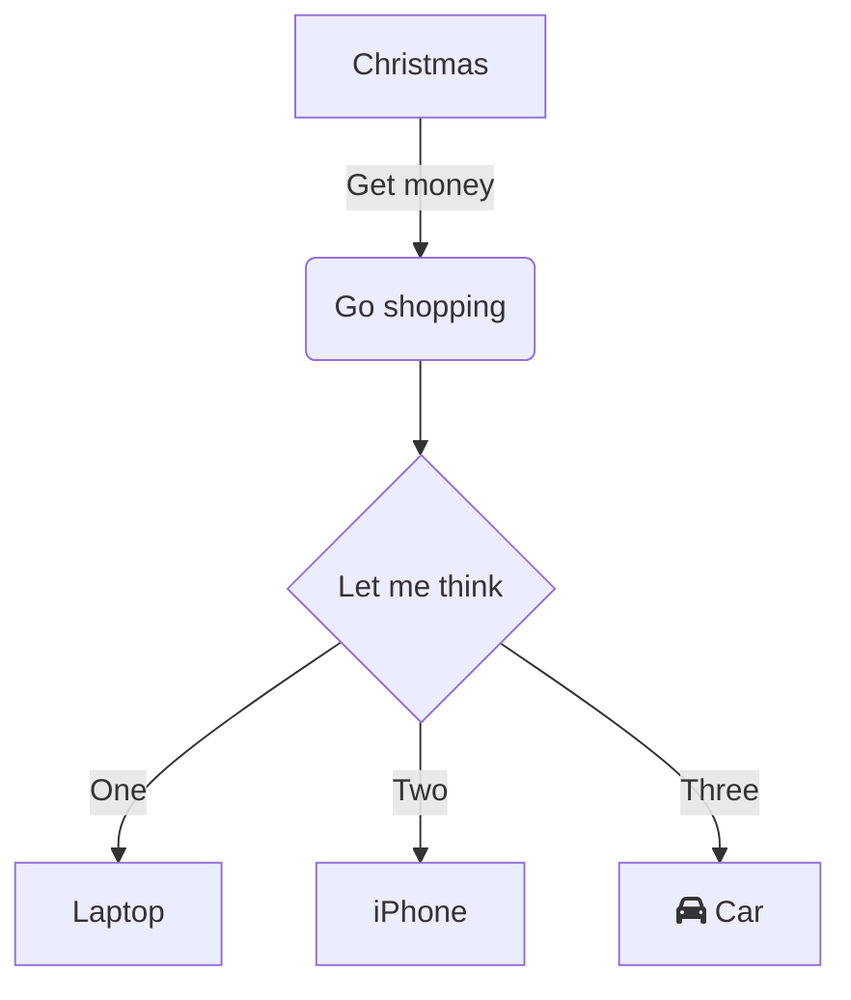
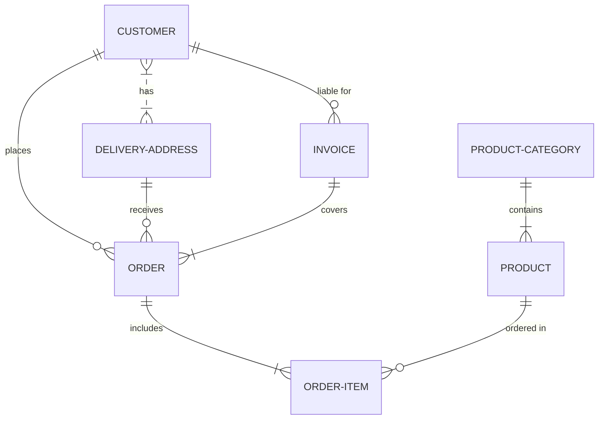
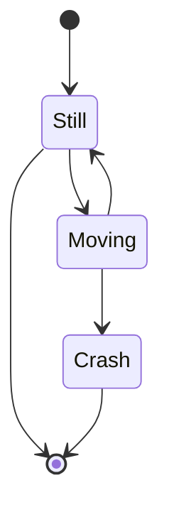

# Mermaid
> Exemplo mermaid

```mermaid
graph TD
  A[Christmas] -->|Get money| B(Go shopping)
  B --> C{Let me think}
  C -->|One| D[Laptop]
  C -->|Two| E[iPhone]
  C -->|Three| F[fa:fa-car Car]
```

## Mermaid (header 2)
> Outro examplo mermaid

```mermaid
erDiagram
        CUSTOMER }|..|{ DELIVERY-ADDRESS : has
        CUSTOMER ||--o{ ORDER : places
        CUSTOMER ||--o{ INVOICE : "liable for"
        DELIVERY-ADDRESS ||--o{ ORDER : receives
        INVOICE ||--|{ ORDER : covers
        ORDER ||--|{ ORDER-ITEM : includes
        PRODUCT-CATEGORY ||--|{ PRODUCT : contains
        PRODUCT ||--o{ ORDER-ITEM : "ordered in"
```

### Mermaid (header 3)
> Mais outro examplo mermaid

```mermaid
stateDiagram
	[*] --> Still
	Still --> [*]

	Still --> Moving
	Moving --> Still
	Moving --> Crash
	Crash --> [*]
					
```