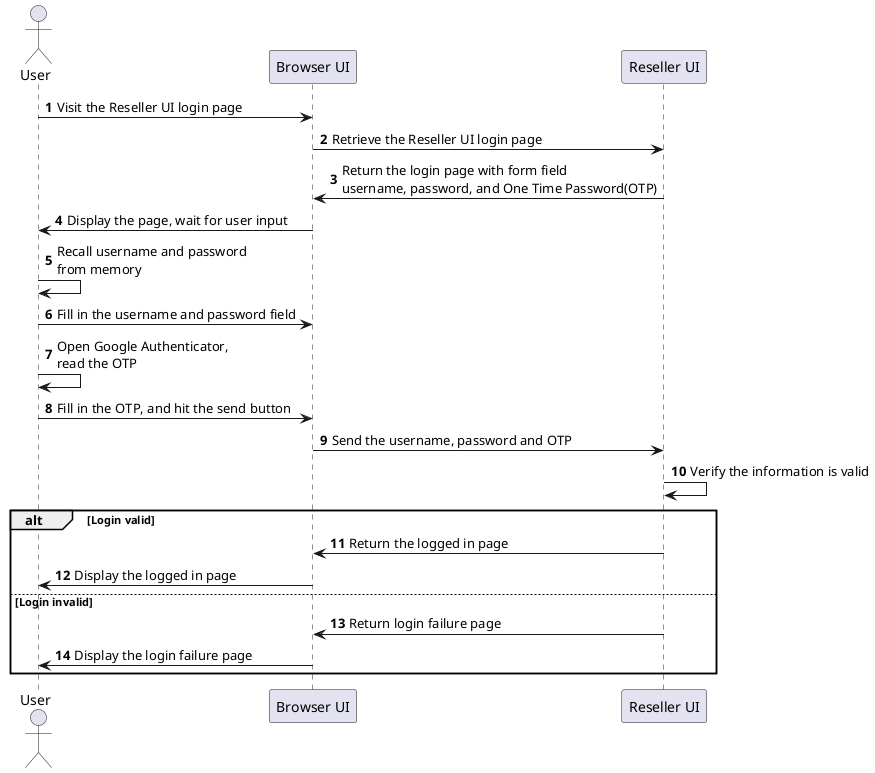
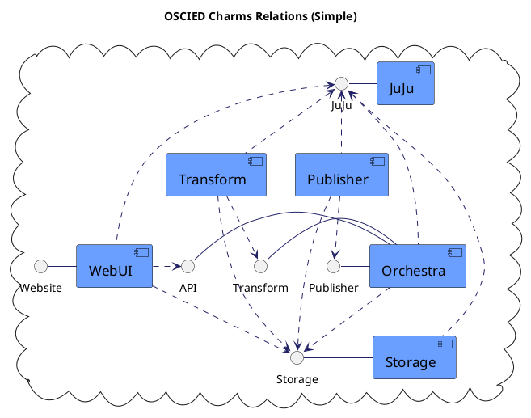
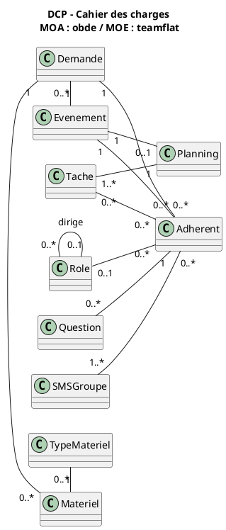

# PlantUML

> Exemplo Plantuml

```plantuml
@startuml
autonumber

actor User as user
participant "Browser UI" as browser
participant "Reseller UI" as reseller_ui

user -> browser : Visit the Reseller UI login page
browser -> reseller_ui : Retrieve the Reseller UI login page
browser <- reseller_ui : Return the login page with form field \nusername, password, and One Time Password(OTP)
user <- browser : Display the page, wait for user input
user -> user: Recall username and password \nfrom memory
user -> browser : Fill in the username and password field
user -> user: Open Google Authenticator, \nread the OTP
user -> browser : Fill in the OTP, and hit the send button
browser -> reseller_ui : Send the username, password and OTP
reseller_ui -> reseller_ui : Verify the information is valid
alt Login valid
    browser <- reseller_ui : Return the logged in page
    user <- browser : Display the logged in page
else Login invalid
    browser <- reseller_ui : Return login failure page
    user <- browser : Display the login failure page
end
@enduml
```

## PlantUML (header 2)

> Mais outro plantuml

```plantuml
@startuml

skinparam component {
    FontColor          black
    AttributeFontColor black
    FontSize           17
    AttributeFontSize  15
    AttributeFontname  Droid Sans Mono
    BackgroundColor    #6A9EFF
    BorderColor        black
    ArrowColor         #222266
}

title "OSCIED Charms Relations (Simple)"
skinparam componentStyle uml2

cloud {
    interface "JuJu" as juju
    interface "API" as api
    interface "Storage" as storage
    interface "Transform" as transform
    interface "Publisher" as publisher
    interface "Website" as website

    juju - [JuJu]

    website - [WebUI]
    [WebUI] .up.> juju
    [WebUI] .down.> storage
    [WebUI] .right.> api

    api - [Orchestra]
    transform - [Orchestra]
    publisher - [Orchestra]
    [Orchestra] .up.> juju
    [Orchestra] .down.> storage

    [Transform] .up.> juju
    [Transform] .down.> storage
    [Transform] ..> transform

    [Publisher] .up.> juju
    [Publisher] .down.> storage
    [Publisher] ..> publisher

    storage - [Storage]
    [Storage] .up.> juju
}

@enduml
```

### PlantUML (header 3)

> Mais outro plantuml

```plantuml
@startuml
title DCP - Cahier des charges\n MOA : <b>obde</b> / MOE : <b>teamflat</b>
left to right direction
skinparam shadowing false

class "Role" as role
class "Adherent" as adherent
class "Materiel" as materiel
class "TypeMateriel" as type
class "Evenement" as evenement
class "Planning" as planning
class "Tache" as tache
class "Demande" as demande
class "Question" as question
class "SMSGroupe" as sms

evenement "1" -- "0..1" planning
evenement "1" -- "0..*" adherent
tache "1..*" -- "1" planning
tache "0..*" -- "0..*" adherent
role "0..1" -- "0..*" adherent
question "0..*" -- "1" adherent
sms "1..*" -- "0..*" adherent
role "0..*" -- "0..1" role : dirige
demande "0..*" - "1" evenement
adherent "0..*" - "1" demande
type "0..*" - "1" materiel
demande "1" - "0..*" materiel

@enduml
```